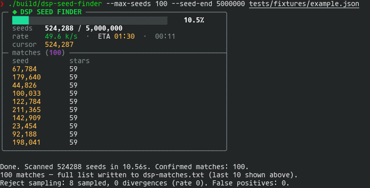

<div align="center">

# 🌌 DSP Seed Finder

**Find your dream Dyson Sphere Program galaxy before you ever start a save.**

Describe the star system you want — rare resources, a blue giant, a black hole
next door — in a small JSON file, and this tool scans millions of galaxy seeds on
your GPU to find the ones that have it.

</div>

---

## ✨ What it does

<div align="center">

</div>

It's a C / CUDA port of the Rust [DSP-Seed-Finder](https://doubleuth.github.io/DSP-Seed-Finder),
so the **same seeds match**.

---

## 🚀 Quick start

Build it once ([instructions →](docs/building.md)), then point it at a conditions
file:

```sh
./dsp-seed-finder conditions.json
```

For each matching seed it prints a tree that mirrors your rule — one system per
branch, one condition per leaf, each annotated with its measured value, so you
can compare seeds at a glance instead of flying blind:

```
◆ 89,808                                      proximité ≤ 8 ly
├─ départ                                     #0   G   0.0 ly
├─ ET                                         #58  O   5.7 ly
│  ├─ océan                                   Sulfur
│  ├─ gaz Fireice                             0.70 /s
│  ├─ veine Stalagmite                        2.06 m
│  └─ veine Organic                           2.06 m
└─ veine Magnet                               #63  BH  6.1 ly · 3.11 m
```

That's it. Open one of those seeds in the game and the systems are there. For
machine-readable output use `--format json` (structured) or `--format csv`.

---

## 📝 A simple conditions file

> *"A system with a sulfuric-acid ocean, and a unipolar magnet system nearby."*

```json
{
  "rule": {
    "type": "and",
    "rules": [
      { "ocean": "Sulfur" },
      { "vein": "Magnet", "op": "present" }
    ]
  }
}
```

- `{ "ocean": "Sulfur" }` — the rule `type` is **inferred** from the key.
- `"op": "present"` — shorthand for *"more than zero"* (there's `absent` too).

Ready-to-run examples live in [`tests/fixtures/`](tests/fixtures).

---

## 📚 Documentation

| | |
|---|---|
| 🛠️ **[Building](docs/building.md)** | GPU build, CPU reference build, requirements |
| 🚀 **[Usage](docs/usage.md)** | every CLI option, the live progress panel, examples |
| 📐 **[Conditions schema](docs/conditions.md)** | the full rule language and enum names |
| 🏗️ **[Architecture](docs/architecture.md)** | how GPU streaming + CPU verification works |
| 🧪 **[Tests](tests/README.md)** | the plain-C self-test suite |

---

<div align="center">
<sub>Built for Blackwell (<code>sm_120</code> / RTX 5070) · runs on any CUDA ≥ 12.8 GPU, or CPU-only.</sub>
</div>
